# NotesApp

<p align="center">
  
</p>


Локальный file-first Markdown-заметник. Репозиторий содержит сохранённую исходную Windows-версию и нативное приложение для macOS Ventura.

> [!IMPORTANT]
> **Приложение находится в активной разработке. Все доступные сборки — черновые beta-версии:** функции могут меняться, а перед использованием важных vault рекомендуется делать резервную копию.

## Скачать beta

- [macOS — Apple Silicon (M1 и новее)](https://github.com/Slipcast-dev/NotesApp/releases/download/v2.0.0-beta.1/NotesApp-v2.0.0-beta.1-macOS-arm64.zip)
- [macOS — Intel](https://github.com/Slipcast-dev/NotesApp/releases/download/v2.0.0-beta.1/NotesApp-v2.0.0-beta.1-macOS-x86_64.zip)
- [Windows — x64 portable](https://github.com/Slipcast-dev/NotesApp/releases/download/v2.0.0-beta.1/NotesApp-v2.0.0-beta.1-win-x64-portable.zip)

Все релизы публикуются с отметкой **Pre-release** до выхода стабильной версии.

## Возможности

- обычная папка-vault и UTF-8 `.md` как единственный источник истины;
- открытие существующих Obsidian vault без конвертации;
- дерево папок, Unicode-пути, create/rename/move/duplicate, drag-and-drop, Finder и системная корзина;
- атомарное автосохранение, рекурсивное наблюдение внешних изменений и явное разрешение конфликтов;
- Source, настоящий визуальный Preview и Reading режимы без RTF в Markdown;
- визуальный редактор Markdown-таблиц: ячейки, шапка, вставка/удаление/перестановка строк и столбцов, выравнивание и клавиатурная навигация;
- интерактивные задачи в Reading: клик по флажку сразу и обратимо меняет `[ ]`/`[x]` в исходном `.md`, включая пустые и вложенные пункты;
- CommonMark/GFM-совместимый AST: tables/tasks/callouts/footnotes, YAML, wikilinks/embeds, block/heading links, math и Mermaid blocks;
- перестраиваемый SQLite FTS5-кэш с phrase/boolean/regex и `path:`, `file:`, `tag:`, `property:`, `task:`, `line:`, `block:` фильтрами;
- outline, outgoing links и backlinks с контекстом;
- вложения через выбор файла, drag-and-drop и paste из clipboard; настраиваемые папки и проверка missing/unused;
- безопасная dry-run миграция legacy SQLite/RTF с backup, YAML metadata, отчётом, идемпотентностью и undo;
- светлая, тёмная и системная тема;
- русский и английский интерфейс;
- security-scoped bookmark последнего vault.

## Нативный порт для macOS

macOS-приложение находится в `Sources/` и построено на SwiftUI с узким AppKit-мостом для системных панелей и plain-text `NSTextView`. Старый rich-text код сохранён только как legacy-вход для миграции и не подключён к новой точке входа.

Интерфейс адаптирован под macOS:

- трёхколоночная навигация: файловое дерево, результаты/список заметок и редактор;
- отдельное системное окно настроек;
- меню приложения и сочетания клавиш `⌘N`, `⌘S`, `⌘⇧N`, `⌘⇧O`, `⌘⌫`;
- нативные боковая панель, toolbar, контекстные меню и системные диалоги.

Минимальная версия — macOS 13 Ventura. В `Package.swift` нет сетевых зависимостей; используется системная библиотека SQLite.

### Сборка и запуск

Из корня проекта:

```bash
./script/build_and_run.sh
```

Проверка запуска:

```bash
./script/build_and_run.sh --verify
```

Готовое приложение создаётся в:

```text
dist/NotesApp.app
```

Рекомендуется Xcode 14.3 или новее. Скрипт также содержит резервный путь сборки для установок Ventura только с Command Line Tools, у которых SwiftPM не может определить `PlatformPath`.

Дополнительные режимы:

```bash
./script/build_and_run.sh --debug
./script/build_and_run.sh --logs
./script/build_and_run.sh --telemetry
./script/build_and_run.sh --package
```

В Codex настроена кнопка **Run**, использующая тот же скрипт.

### Vault и перенос старых данных

По умолчанию создаётся отдельный Markdown vault:

```text
~/Library/Application Support/NotesApp/Vault
```

Любую другую папку можно открыть как vault. `.notesapp` содержит только удаляемые настройки/manifest/индекс; удаление `index.sqlite` не затрагивает заметки и индекс будет построен заново.

Для переноса Windows/macOS legacy-хранилища откройте **Settings → Migration** и выберите папку, содержащую:

```text
notes.db
settings.json
note-000001.md (если создавался старой версией)
...
```

Исходная папка и target vault должны различаться. Сервис открывает базу read-only, сам создаёт согласованную резервную копию и никогда не удаляет исходные данные. Сначала доступен dry-run.

### Тесты

При установленном полном Xcode:

```bash
swift test
```

В текущем окружении только с Ventura Command Line Tools:

```bash
./script/test_with_command_line_tools.sh
```

Наборы проверяют file-first CRUD/atomic conflicts/Unicode, RTF migration, Markdown AST/render/round-trip, интерактивные таблицы и задачи, FTS/index/backlinks/search и attachments. Полный список этапов и фактических проверок находится в [`IMPLEMENTATION_PLAN.md`](IMPLEMENTATION_PLAN.md).

## Исходная Windows-версия

Windows-приложение сохранено в `NotesApp/NotesApp/` без удаления исходного кода.

- C# и .NET 8;
- WinUI 3 / Windows App SDK;
- Entity Framework Core + SQLite;
- CommunityToolkit.Mvvm.

Проверочная сборка Windows:

```powershell
dotnet build NotesApp\NotesApp\NotesApp.csproj -c Debug -r win-x64
```

Portable-публикация:

```powershell
powershell -ExecutionPolicy Bypass -File Tools\PublishPortable.ps1
```

## Структура

```text
NotesApp/
├─ Package.swift                  # SwiftPM, macOS 13+
├─ Sources/
│  ├─ NotesApp/                   # SwiftUI-приложение, views и store
│  ├─ NotesCore/                  # vault, AST, migration, rebuildable index, links, attachments
│  └─ CSQLite/                    # системный модуль SQLite
├─ Tests/                         # XCTest и исполняемые offline smoke-наборы
├─ script/                        # сборка и запуск macOS
├─ NotesApp/NotesApp/             # исходная Windows-версия
└─ Tools/                         # Windows portable-скрипты
```

## Лицензия

Проект распространяется по лицензии MIT. Подробности в [LICENSE](LICENSE).
