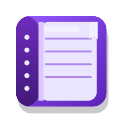

# NotesApp

<p align="center">
  
</p>


Простой настольный заметник для Windows: создать заметку, быстро отредактировать текст, разложить записи по тегам и хранить все локально без облака и лишней сложности.

## Что умеет

- Локальное хранение заметок в SQLite.
- Отдельные файлы заметок рядом с базой для переносимого хранения.
- Богатое форматирование текста в редакторе: жирный, курсив, шрифт, размер, заголовки, таблицы и чек-листы.
- Теги с цветами для навигации по заметкам.
- Поиск, сортировка и корзина удаленных заметок.
- Внутренние ссылки между заметками в формате `[[Название заметки]]`.
- Светлая, темная и системная тема.
- Portable-сборка: приложение можно запускать из папки без установки.

## Технологии

- C# и .NET 8.
- WinUI 3 / Windows App SDK.
- Entity Framework Core + SQLite.
- CommunityToolkit.Mvvm.
- JSON-настройки и MVVM-архитектура.

## Структура

```text
NotesApp-3.0/
├─ NotesApp/
│  ├─ NotesApp.sln
│  └─ NotesApp/
│     ├─ Assets/          # иконка приложения
│     ├─ Converters/      # XAML-конвертеры
│     ├─ Data/            # EF Core и инициализация базы
│     ├─ Infrastructure/  # пути, markdown-файлы, служебные helpers
│     ├─ Localization/    # русская и английская локализация
│     ├─ Models/          # модели данных
│     ├─ Services/        # работа с БД, настройками и диалогами
│     ├─ Styles/          # темы и общие стили
│     ├─ ViewModels/      # MVVM-логика экранов
│     └─ Views/           # WinUI-экраны
├─ Tools/                 # публикация и запуск portable-версии
└─ Run.cmd                # сборка и запуск portable-версии
```

## Требования

- Windows 10 1809 или новее.
- .NET SDK 8.0 для сборки из исходников.
- Visual Studio 2022 с Windows App SDK workload или совместимая CLI-среда.

## Сборка

Проверочная сборка:

```powershell
dotnet build NotesApp\NotesApp\NotesApp.csproj -c Debug -r win-x64
```

Portable-публикация:

```powershell
powershell -ExecutionPolicy Bypass -File Tools\PublishPortable.ps1
```

Готовая папка появится в:

```text
dist\portable\win-x64
```

Архив portable-версии появится в:

```text
dist\portable\NotesApp-win-x64-portable.zip
```

## Запуск

Из корня проекта:

```powershell
.\Run.cmd
```

Или после публикации:

```powershell
.\dist\portable\win-x64\Run.cmd
```

## Данные

В portable-режиме пользовательские данные хранятся рядом с приложением в папке `Data`:

- `notes.db` - локальная SQLite-база.
- `settings.json` - настройки приложения.
- `storage-location.json` - выбранное хранилище.

Папка `Data` не попадает в репозиторий и релизный архив, чтобы не публиковать личные заметки.

## Лицензия

Проект распространяется под лицензией MIT. Подробности в [LICENSE](LICENSE).
